

  

<!-- Replace with your actual logo -->

# 🛡️ NeRuWallet

**A High-Security, AI-Powered Financial Transaction Ecosystem.**
Built with Flutter, Rust, and Hardware HSMs, NeRuWallet is an engineering-first platform that
harmonizes fluid Material 3 design with an uncompromising "Defense in Depth" security architecture,
now featuring **Hardware-Backed Multi-Signature Vaults**.

[Security Pipeline](#security-pipeline) · [Neru AI](#neru-ai) · [UX Philosophy](#ux-philosophy) · [Screenshots](#screenshots) · [Architecture](#architecture) · [Getting Started](#getting-started)

---

##  📖 Project Philosophy

**NeRuWallet** is designed to demonstrate that elite security engineering and premium user
experience are not mutually exclusive. Most mobile wallets prioritize ease of use at the cost of
software-based vulnerabilities; NeRuWallet anchors every transaction in **Physical Hardware (HSM)**
and high-performance **Rust code**, while delivering a modern, "Liquid UI" experience.

---

##  🔒 The Secure Signing Pipeline (HSM + Rust)

NeRuWallet implements a unique multi-layered signing pipeline. Private keys are never generated in
software and never touch the application's memory.

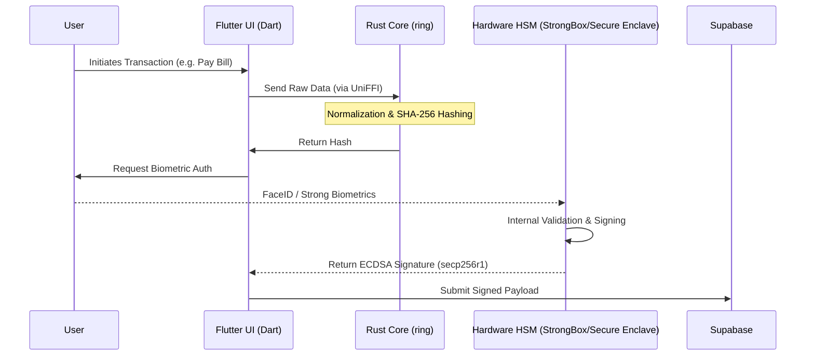

### 🛡️ Hardware-Rooted Trust

- **Android StrongBox**: Utilizes a dedicated security-certified chip (where available) to generate
  non-exportable 256-bit EC keys.
- **iOS Secure Enclave**: Leverages the hardware-isolated coprocessor for key generation and
  cryptographic operations.
- **Biometric Crypto-Gating**: Signatures are physically locked. The hardware only authorizes a
  signature if a biometric challenge is successfully completed in the same session.

### 🦀 Rust Hashing & Verification Layer

To ensure the integrity of the data being signed, a custom **Rust module** handles normalization and
cryptographic verification. By using the `ring` crate, we eliminate entire classes of memory-safety
vulnerabilities.

- **Signature Verification**: For Multi-Sig transactions, the Rust core validates ECDSA signatures
  from peer devices before the local HSM authorizes a co-signature.
- **High-Performance Hashing**: Transaction data is normalized and hashed using SHA-256 within the
  Rust memory boundary via UniFFI.

### 🛡️ Hardening & Anti-Reverse Engineering

NeRuWallet employs "Defense in Depth" to protect against sophisticated attacks:

- **AOT Obfuscation**: Production builds use Flutter's `--obfuscate` flag to rename Dart symbols,
  making decompilation significantly harder.
- **R8/ProGuard Hardening**: Android binaries are further shrunk and obfuscated using custom
  ProGuard
  rules, targeting internal logic and removing log traces.
- **Environment Integrity**:
    - **Jailbreak/Root Detection**: Blocks execution on compromised devices to prevent runtime
      memory hooking (e.g., via Frida).
    - **Emulator Protection**: Detects virtualized environments to prevent automated dynamic
      analysis.
- **Runtime Protection**:
    - **Active Auth Watchdog**: Monitors the Supabase authentication stream in real-time. If a
      session
      is invalidated (e.g., user deleted via backend or token refresh failure), the app instantly
      triggers a global lock-out and redirects to login, preventing "orphaned" sessions.
    - **Screen Guard**: Prevents screenshots and screen recording on sensitive screens using
      `FLAG_SECURE` (Android) and `isCaptured` detection (iOS).
    - **SSL Pinning**: (Roadmap) Enforces cryptographic trust for connections to Supabase and Gemini
      APIs.

---

##  🤝 Hardware Multi-Sig Vaults

NeRuWallet enables collaborative finance through **M-of-N Multi-Signature Wallets**. Unlike software
multisigs, every participant's approval is anchored in their own device's hardware.

1. **Identity Exchange**: Users share hardware-backed public keys (non-exportable) to form a vault.
2. **Approval Workflow**: When a transaction is initiated, co-signers receive real-time
   notifications via Supabase.
3. **Biometric Authorization**: Each co-signer must pass a biometric challenge to unlock their
   StrongBox/Secure Enclave and produce a valid signature.
4. **Finalization**: Once the threshold is met, the transaction is cryptographically finalized and
   broadcast.

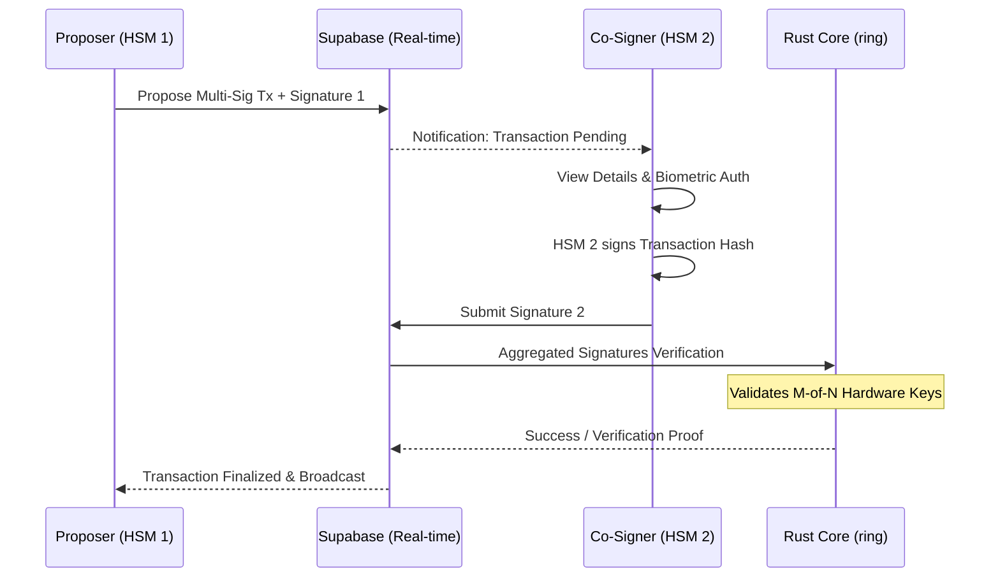

---

##  🤖 Neru AI: The Intelligent Advisor

NeRuWallet integrates **Gemini 3.5 Flash** to provide deep financial forensics. This isn't just a
chatbot; it's an autonomous financial agent.

- **Prompt Engineering & JSON Constraints**: All AI interactions are governed by strict system
  prompts that enforce JSON-only responses, ensuring deterministic integration with the app's UI.
- **Autonomous Preference Management**: The AI can suggest and *automatically update* app
  preferences (e.g., setting a monthly budget) through structured function calling.
- **Gamified Insights**: To ensure data quality, AI analysis is unlocked only after a user reaches a
  transaction volume of **Rs. 10,000**, encouraging active financial management.
- **Data Privacy Barrier**: Only aggregated statistics and masked metadata are sent to the AI,
  maintaining a strict privacy boundary between your financial details and the LLM.

---

##  ✨ The "Liquid UI" Strategy

The UI is built on a **Custom Design System** that extends Material 3 with a focus on motion and
transparency.

- **Design System**: Built around the **Outfit** typeface and a high-contrast palette of **Indigo (
  Primary)** and **Emerald (Success)**.
- **Glassmorphism**: Extensive use of `GlassDialog` and backdrop filters to create a layered, modern
  aesthetic that feels premium and light.
- **Motion Design**:
    - **Staggered Entrances**: Dashboard elements enter using `flutter_animate` with slight delays
      to create a fluid, organic feel.
    - **Sliver Architecture**: Native-feeling scrolling experiences using `CustomScrollView` and
      `SliverAppBar`.
    - **Haptic Feedback**: Micro-interactions are reinforced with subtle vibrations to create a
      tactile sense of security.

---

##  📸 Screenshots

### 🏠 Core Experience

|                 Splash                  |              Login              |                Dashboard                |               Profile               |
|:---------------------------------------:|:-------------------------------:|:---------------------------------------:|:-----------------------------------:|
| 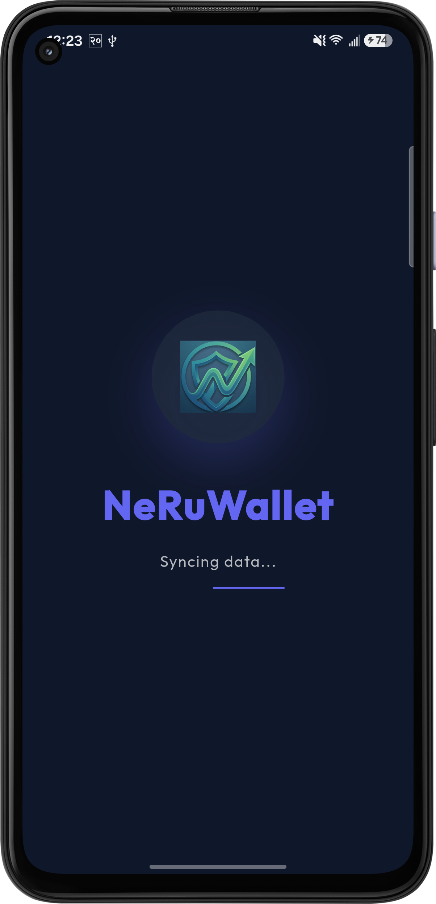 | 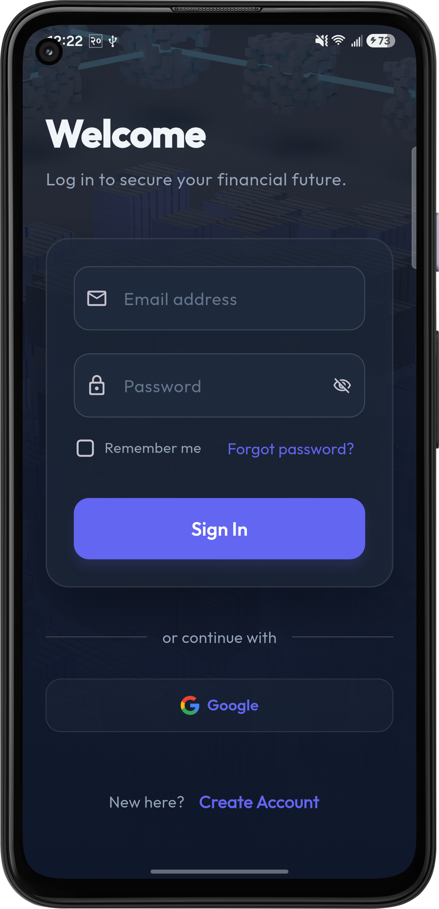 | 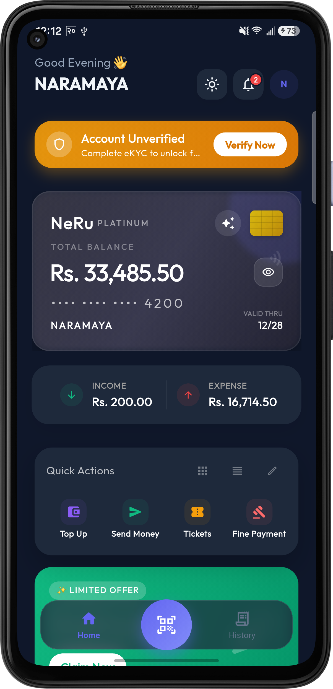 | 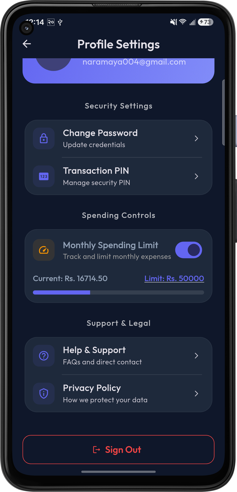 |

### 🤖 Neru AI: Intelligence Advisor

|            Initial            |           Analysis            |           Insights            |             Chat              |
|:-----------------------------:|:-----------------------------:|:-----------------------------:|:-----------------------------:|
| 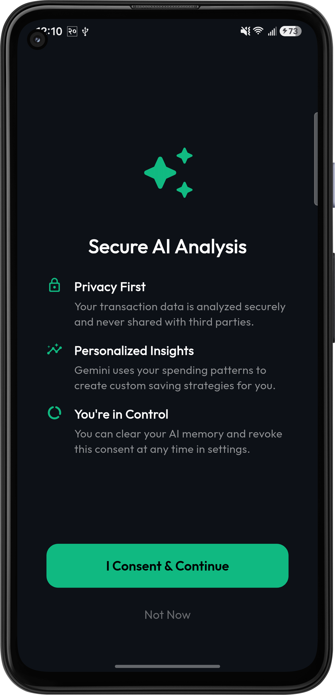 | 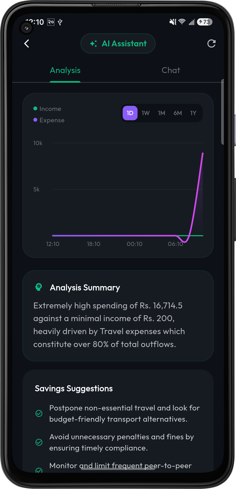 | 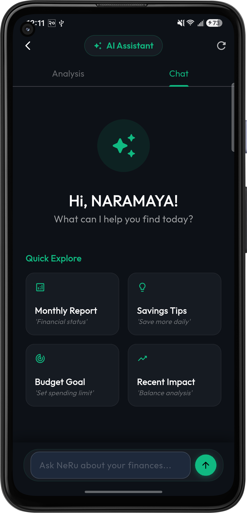 | 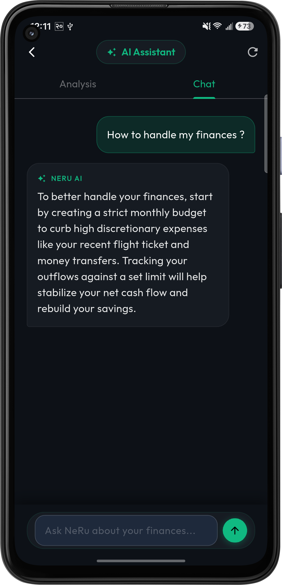 |

### 💸 Secure Transaction Flow

|                 Step 1                 |                 Step 2                 |                 Step 3                 |                 Step 4                 |
|:--------------------------------------:|:--------------------------------------:|:--------------------------------------:|:--------------------------------------:|
| 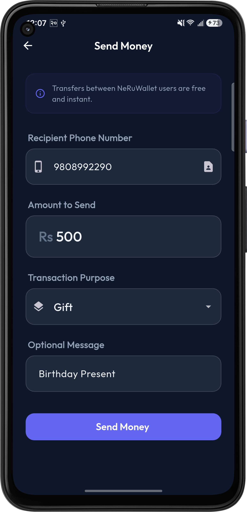 | 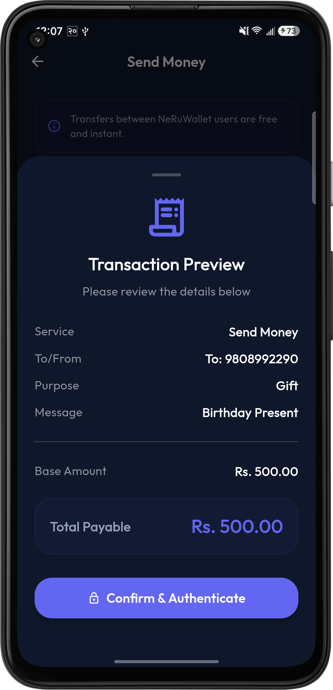 | 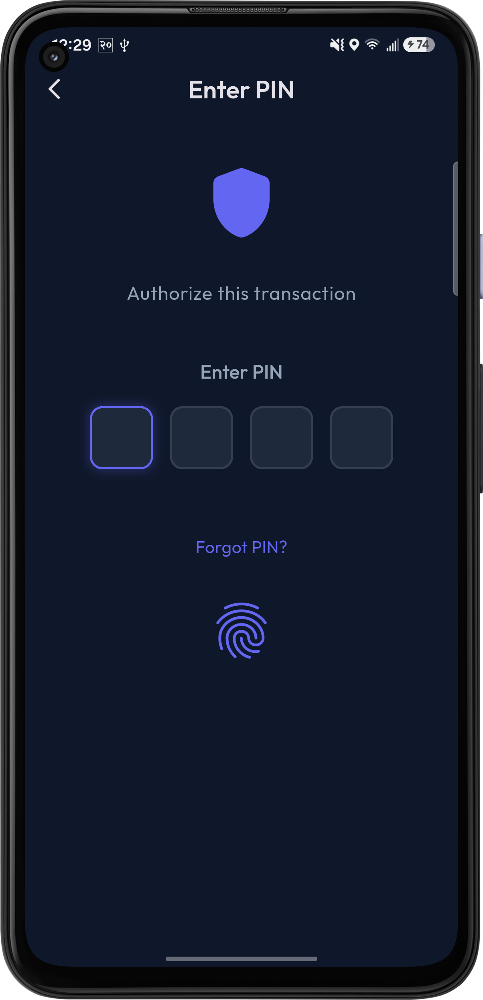 | 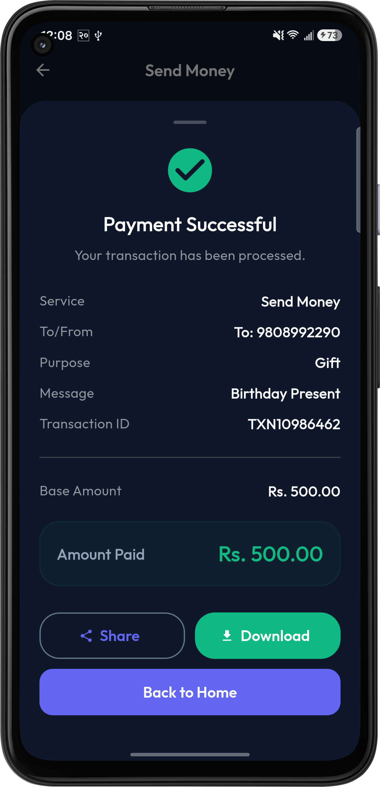 |

### 📊 Utility & QR

|               History               |            QR Scan            |            QR Code            |
|:-----------------------------------:|:-----------------------------:|:-----------------------------:|
| 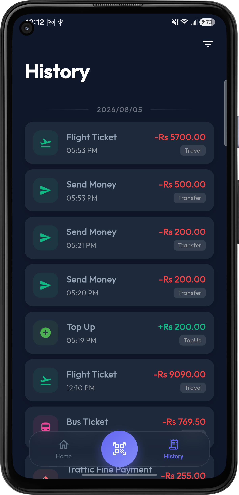 | 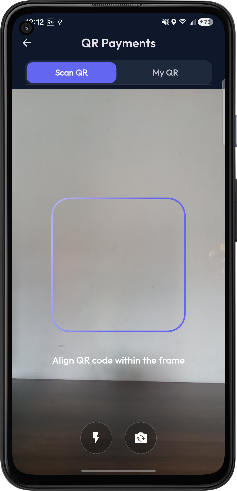 | 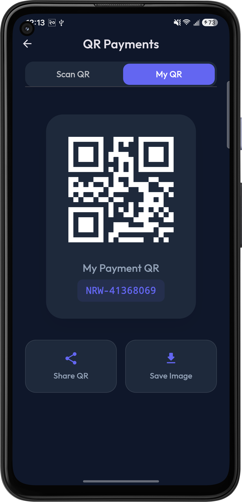 |

---

##  🛠 Tech Stack

| Layer                  | Technology                                                    |
|:-----------------------|:--------------------------------------------------------------|
| **Mobile Core**        | **Flutter (3.11+)**, **Riverpod (Code Generation)**           |
| **Security Hardware**  | **Android StrongBox / TEE**, **iOS Secure Enclave**           |
| **Systems Layer**      | **Rust**, **ring** (Crypto), **UniFFI** (Bridge)              |
| **Security Hardening** | **R8 Obfuscation**, **Root Detection**, **Screen Protection** |
| **Data Engine**        | **Supabase** (Realtime/Auth), **Drift** (Reactive SQLite)     |
| **Design & UX**        | **Material 3**, **Flutter Animate**, **Lottie**, **FL Chart** |
| **AI Integration**     | **Google Gemini 3.5 Flash**, **Prompt Engineering**           |

---

##  🏗️ Component Architecture

NeRuWallet follows a **Feature-First Architecture**, ensuring that domain logic (AI, Payments, Auth)
is isolated and testable.

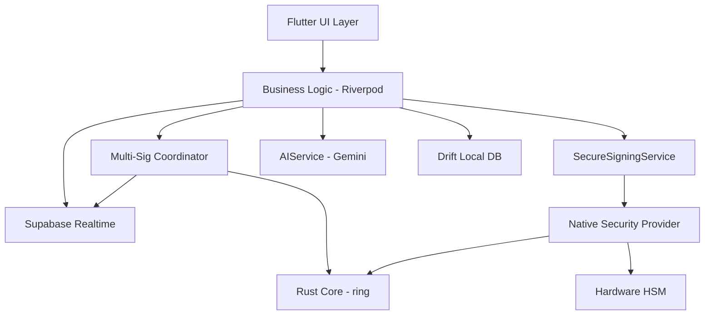

---

## 🚀 Roadmap

- [x] **Multi-Signature Wallets**: Shared hardware-backed accounts.
- [ ] **NFC Tap-to-Pay**: Fully integrated contactless transaction pipeline.
- [ ] **Wear OS Companion**: Real-time alerts and biometric verification from your wrist.

---

## 📄 License

This project is licensed under the MIT License - see the [LICENSE](LICENSE) file for details.

---

Built for the future of secure finance.

