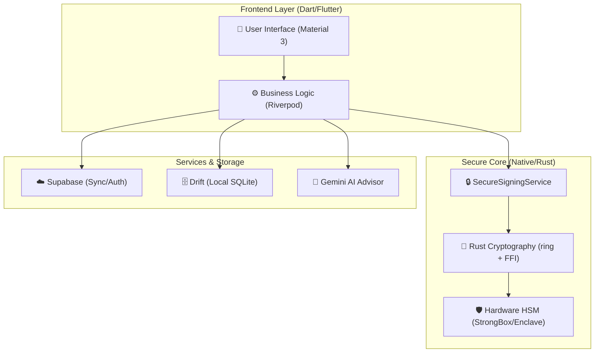
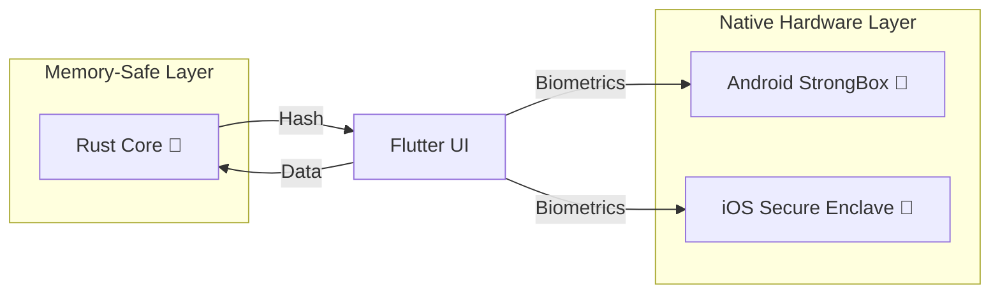
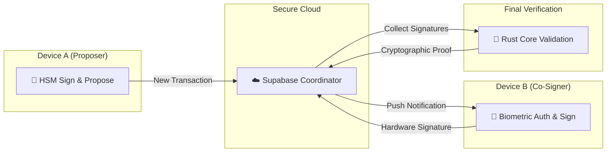

<div align="center">


<a href="https://github.com/devmilang99/NeRuWallet/actions/workflows/flutter_ci_cd.yml">
  
</a>

<br /><br />

<!-- Replace with your actual logo -->

# 🛡️ NeRuWallet

**A High-Security, AI-Powered Financial Transaction Ecosystem.**
Built with Flutter, Rust, and Hardware HSMs, NeRuWallet is an engineering-first platform that
harmonizes fluid Material 3 design with an uncompromising "Defense in Depth" security architecture,
now featuring **Hardware-Backed Multi-Signature Vaults**.

[Architecture](#architecture) · [Security Pipeline](#security-pipeline) · [Neru AI](#neru-ai) · [UX Philosophy](#ux-philosophy) · [Screenshots](#screenshots) · [Installation](#installation) · [Get Started](#get-started)

---

</div>

<a id="overview"></a>

## 📖 Project Philosophy

**NeRuWallet** is designed to demonstrate that elite security engineering and premium user
experience are not mutually exclusive. Most mobile wallets prioritize ease of use at the cost of
software-based vulnerabilities; NeRuWallet anchors every transaction in **`Physical Hardware (HSM)`
**
and high-performance **`Rust code`**, while delivering a modern, "Liquid UI" experience.

### 🗄️ Offline-First & Atomic Sync

NeRuWallet is built with an **Offline-First** philosophy. Using **`Drift (SQLite)`**, all
transaction
data, AI memories, and user preferences are persisted locally with reactive stream updates. A custom
**`SyncService`** handles **`Atomic Synchronization`** with Supabase, ensuring data consistency even
across flaky network conditions.

---

<a id="architecture"></a>

## 🏗️ Component Architecture

NeRuWallet follows a **Feature-First Architecture**, ensuring that domain logic (AI, Payments, Auth)
is isolated and testable.



---

<a id="security-pipeline"></a>

## 🔒 The Secure Signing Pipeline (HSM + Rust)

NeRuWallet implements a unique multi-layered signing pipeline. Private keys are never generated in
software and never touch the application's memory.



### 🛡️ Hardware-Rooted Trust

- **`[Android 🤖] StrongBox`**: Utilizes a dedicated security-certified chip (where available) to
  generate
  non-exportable 256-bit EC keys.
- **`[iOS 🍎] Secure Enclave`**: Leverages the hardware-isolated coprocessor for key generation and
  cryptographic operations.
- **`[Security 🛡️] Biometric Crypto-Gating`**: Signatures are physically locked. The hardware only
  authorizes a
  signature if a biometric challenge is successfully completed in the same session.

### 🦀 Rust Hashing & Verification Layer

To ensure the integrity of the data being signed, a custom **Rust module** handles normalization and
cryptographic verification. By using the `ring` crate, we eliminate entire classes of memory-safety
vulnerabilities.

- **`Signature Verification`**: For Multi-Sig transactions, the Rust core validates
  ECDSA signatures
  from peer devices before the local HSM authorizes a co-signature.
- **`High-Performance Hashing`**: Transaction data is normalized and hashed using
  SHA-256 within the Rust memory boundary via direct FFI (**flutter_rust_bridge**).
- **`Direct FFI Pipeline`**: The Rust core is integrated using high-performance
  **direct FFI bindings**, bypassing the overhead of traditional platform channels for
  cryptographic operations.

### 🛡️ Hardening & Anti-Reverse Engineering

NeRuWallet employs "Defense in Depth" to protect against sophisticated attacks:

- **` AOT Obfuscation`**: Production builds use Flutter's `--obfuscate` flag to rename
  Dart symbols,
  making decompilation significantly harder.
- **` R8/ProGuard Hardening`**: Android binaries are further shrunk and obfuscated using
  custom
  ProGuard rules, targeting internal logic and removing log traces.
- **` Environment Integrity`**:
    - **`Jailbreak/Root Detection`**: Blocks execution on compromised devices to prevent runtime
      memory hooking (e.g., via Frida).
    - **`Emulator Protection`**: Detects virtualized environments to prevent automated dynamic
      analysis.
- **` Runtime Protection`**:
    - **`Active Auth Watchdog`**: Monitors the Supabase authentication stream in real-time. If a
      session is invalidated, the app instantly triggers a global lock-out.
    - **`Screen Guard`**: Prevents screenshots and screen recording on sensitive screens using
      `FLAG_SECURE` (Android) and `isCaptured` detection (iOS).
    - **`SSL Pinning`**: (Roadmap) Enforces cryptographic trust for connections to Supabase and
      Gemini
      APIs.

---

<a id="multi-sig"></a>

## `[Security 🛡️]` Hardware Multi-Sig Vaults

NeRuWallet enables collaborative finance through **`M-of-N Multi-Signature Wallets`**. Unlike
software
multisigs, every participant's approval is anchored in their own device's hardware.

1. **`Identity Exchange`**: Users share hardware-backed public keys (non-exportable) to form a
   vault.
2. **`Approval Workflow`**: When a transaction is initiated, co-signers receive real-time
   notifications via Supabase.
3. **`Biometric Authorization`**: Each co-signer must pass a biometric challenge to unlock their
   **`StrongBox/Secure Enclave`** and produce a valid signature.
4. **`Finalization`**: Once the threshold is met, the transaction is cryptographically finalized and
   broadcast.



---

<a id="neru-ai"></a>

## `[AI 🤖]` Neru AI: The Intelligent Advisor

NeRuWallet integrates **`Gemini 3.5 Flash`** to provide deep financial forensics. This isn't just a
chatbot; it's an autonomous financial agent.

- **`Prompt Engineering & JSON Constraints`**: All AI interactions are governed by strict system
  prompts that enforce JSON-only responses, ensuring deterministic integration with the app's UI.
- **`Autonomous Preference Management`**: The AI can suggest and *automatically update* app
  preferences (e.g., setting a monthly budget) through structured function calling.
- **`Gamified Insights`**: To ensure data quality, AI analysis is unlocked only after a user reaches
  a
  transaction volume of **Rs. 10,000**, encouraging active financial management.
- **`Data Privacy Barrier`**: Only aggregated statistics and masked metadata are sent to the AI,
  maintaining a strict privacy boundary between your financial details and the LLM.

---

<a id="ux-philosophy"></a>

## `[UX/UI ✨]` The "Liquid UI" Strategy

The UI is built on a **Custom Design System** that extends Material 3 with a focus on motion and
transparency.

- **`Design System`**: Built around the **`Outfit`** typeface and a high-contrast palette of *
  *`Indigo (Primary)`** and **`Emerald (Success)`**.
- **`Glassmorphism`**: Extensive use of **`GlassDialog`** and backdrop filters to create a layered,
  modern
  aesthetic that feels premium and light.
- **`Motion Design`**:
    - **`Staggered Entrances`**: Dashboard elements enter using **`flutter_animate`** with slight
      delays
      to create a fluid, organic feel.
    - **`Sliver Architecture`**: Native-feeling scrolling experiences using **`CustomScrollView`**
      and
      **`SliverAppBar`**.
    - **`Haptic Feedback`**: Micro-interactions are reinforced with subtle vibrations to create a
      tactile sense of security.

---

<a id="production-optimization"></a>

## `[Optimization 🛠️]` Production Optimization & Code Quality

NeRuWallet is engineered for production-grade performance and maintainability.

- **`Clean Architecture`**: Consistently follows a **Feature-First** structure, ensuring high
  modularity and easy scalability.
- **`Redundancy-Free Codebase`**: Recently optimized to remove legacy duplicate features, reducing
  project noise and maintaining a single source of truth.
- **`Zero-Error Analysis`**: The codebase passes `flutter analyze` with **0 fatal errors**, adhering
  to strict linting rules (**`analysis_options.yaml`**) for clean, predictable code.
- **`Optimized Bundle Size`**: Unused dependencies like `lottie` and `font_awesome_flutter` have
  been
  stripped to ensure a lean binary size for the final APK/IPA.
- **`Automated Refactoring`**: Leverages **`dart fix`** and **`build_runner`** to maintain
  consistent code
  style and up-to-date generated providers.

---

<a id="cicd"></a>

## `[DevOps ⚙️]` CI/CD & Engineering Excellence

NeRuWallet is backed by a robust **`GitHub Actions`** pipeline that ensures every commit meets
high-quality standards across both Android and iOS.

- **`Automated Validation`**: Every Pull Request and push to `main` triggers a pipeline that runs
  **`flutter analyze`** and **`flutter test`** to prevent regressions.
- **`Code Generation`**: Automated **`build_runner`** execution ensures that Riverpod providers and
  Drift
  database classes are always consistent in the build environment.
- **`Continuous Delivery`**:
    - **`Android 🤖`**: Automated release APK generation, uploaded as a GitHub Action artifact for
      instant testing.
    - **`iOS 🍎`**: Automated builds on macOS runners to ensure platform-specific
      compatibility and library linking (CocoaPods) are correct.
- **`Optimized Build Performance`**: Integrated multi-layer caching for **Flutter (Pub)**, *
  *Android (Gradle)**, and **Rust (Cargo)** to significantly reduce CI cycle times and avoid
  redundant dependency downloads.

---

<a id="screenshots"></a>

## 📸 Screenshots

### 🏠 Core Experience

|                        Splash                        |                     Login                     |                     Dashboard                     |                     Profile                     |
|:----------------------------------------------------:|:---------------------------------------------:|:-------------------------------------------------:|:-----------------------------------------------:|
|  |  |  |  |

### 🤖 Neru AI: Intelligence Advisor

|                   Initial                    |                   Analysis                   |                   Insights                   |                     Chat                     |
|:--------------------------------------------:|:--------------------------------------------:|:--------------------------------------------:|:--------------------------------------------:|
|  |  |  |  |

### 💸 Secure Transaction Flow

|                       Step 1                        |                       Step 2                        |                       Step 3                        |                       Step 4                        |
|:---------------------------------------------------:|:---------------------------------------------------:|:---------------------------------------------------:|:---------------------------------------------------:|
|  |  |  |  |

### 📊 Utility & QR

|                     History                     |                   QR Scan                    |                   QR Code                    |
|:-----------------------------------------------:|:--------------------------------------------:|:--------------------------------------------:|
|  |  |  |

---

<a id="why-this-stack"></a>

## 🤔 Why This Stack?

The NeRuWallet architecture was meticulously selected to solve the "Fintech Trilemma":
**Security**, **Performance**, and **User Experience**.

- **`Why Rust?`**: We use Rust for the core cryptographic layer because it offers C-level
  performance
  with mathematical memory safety. By handling sensitive hashing and signature verification in Rust,
  we eliminate entire categories of memory-corruption bugs that often plague native FFI bridges.
- **`Why Hardware HSMs?`**: Storing private keys in software is a single point of failure. By
  anchoring trust in **`StrongBox`** and **`Secure Enclave`**, we ensure that even a compromised
  operating system cannot extract the user's keys.
- **`Why Riverpod & Code Gen?`**: To maintain a complex, multi-layered state (Rust FFI, Supabase
  Realtime, and Drift SQLite), we chose Riverpod. Its compile-time safety and declarative nature
  ensure that the app remains predictable and easy to test as new features are added.
- **`Why Offline-First?`**: Financial apps must be reliable. Using Drift for local persistence
  ensures
  that users can manage their assets in low-connectivity areas, with atomic sync handling the cloud
  reconciliation automatically.
- **`Why Gemini 3.5 Flash?`**: We chose a "Flash" model to optimize for speed and cost while
  providing
  deep financial forensics. By using strict JSON schema enforcement, the AI acts as a reliable
  internal service rather than just a conversational bot.
- **`Why Dynamic Theme Selection?`**: Users can choose between multiple premium Material 3 themes
  (Indigo, Midnight, Emerald, Rose) that adapt the entire application's visual language instantly.

---

<a id="tech-stack"></a>

## 🛠 Tech Stack

| Layer                 | Technology                    | Platform / Security Marker                          |
|:----------------------|:------------------------------|:----------------------------------------------------|
| **Mobile Core**       | **Flutter 3.x**, **Riverpod** | 📱 **Cross-Platform** Reactive State Engine         |
| **Systems Core**      | **Rust (Direct FFI)**         | 🦀 **Memory-Safe** SHA-256 & ECDSA Verification     |
| **Security Hardware** | **StrongBox / Enclave**       | 🤖 **StrongBox** / 🍎 **Secure Enclave** (HSM)      |
| **Persistence**       | **Drift (SQLite)**            | 🗄️ **Offline-First** Local Persistence             |
| **Cloud/Sync**        | **Supabase**                  | ☁️ **Real-time** Atomic Synchronization             |
| **Intelligence**      | **Gemini 3.5 Flash**          | 🤖 **AI Forensics** via structured tool-calling     |
| **Vision**            | **Google ML Kit**             | 🛡️ **eKYC** & Face Liveness Recognition            |
| **Design**            | **Material 3 Themes**         | 🎨 **Dynamic** UI (Indigo, Midnight, Emerald, Rose) |

---

## 🚀 Roadmap

- [x] **Multi-Signature Wallets**: Shared hardware-backed accounts.
- [x] **eKYC Integration**: AI-powered biometric identity verification.
- [ ] **NFC Tap-to-Pay**: Fully integrated contactless transaction pipeline.
- [ ] **Wear OS Companion**: Real-time alerts and biometric verification from your wrist.

---

<a id="installation"></a>

## 📲 Installation & Deployment

### 🎯 Quick Start (Direct APK)

*

*
⬇️ [Download APK from Build Artifacts](https://github.com/devmilang99/NeRuWallet/actions/runs/32239538812/artifacts/9360559423)
**

> [!TIP]
> This APK is automatically built and packaged from the latest source code via GitHub Actions CI/CD
> pipeline.

### ✅ System Requirements

| Requirement             | Specification                              |
|-------------------------|--------------------------------------------|
| **Min Android Version** | Android 6.0 (API Level 23)                 |
| **Storage Space**       | ~100MB free                                |
| **Permissions**         | Camera (QR), Contacts (Optional), Internet |

### 🚀 Installation Methods

<details>
<summary><b>Method 1: Direct Installation (Easiest)</b></summary>

1. **Download**: Click the link above to get the `.apk` file.
2. **Settings**: Enable **"Unknown Sources"** in your device settings.
3. **Install**: Tap the downloaded file and confirm.
4. **Launch**: Grant permissions (Camera, Contacts) for full functionality.

</details>

<details>
<summary><b>Method 2: Command Line (ADB)</b></summary>

```bash
# Connect device & verify
adb devices

# Install APK
adb install path/to/NeRuWallet.apk

# Launch app
adb shell am start -n com.devmilang99.neruwallet/.MainActivity
```

</details>

### 🔒 Security & Permissions

| Permission        | Purpose                                     |
|-------------------|---------------------------------------------|
| **INTERNET**      | Sync transactions with Supabase & Gemini AI |
| **CAMERA**        | QR code scanning for payments               |
| **READ_CONTACTS** | Recipient suggestions                       |
| **WRITE_STORAGE** | Encrypted transaction backups               |

---

<a id="get-started"></a>

## 🚀 Get Started (Developer Setup)

To get a local copy up and running for development, follow these steps:

1. **Clone the repository**: `git clone https://github.com/devmilang99/NeRuWallet.git`
2. **Install Flutter dependencies**: `flutter pub get`
3. **Setup Rust Toolchain**:
    - Install Rust: `curl --proto '=https' --tlsv1.2 -sSf https://sh.rustup.rs | sh`
    - Install FRB Codegen: `cargo install flutter_rust_bridge_codegen`
    - Add Android targets:
      `rustup target add aarch64-linux-android armv7-linux-androideabi i686-linux-android x86_64-linux-android`
    - Add iOS targets (macOS only):
      `rustup target add aarch64-apple-ios x86_64-apple-ios aarch64-apple-ios-sim`
4. **Setup Environment**: Create a `.env` file in the root directory and add your `GEMINI_API_KEY`
   and Supabase credentials.
5. **iOS Specifics**: For Google & Apple Sign-In configuration, refer to
   the [iOS Setup Guide](file:///D:/For Portfolio/NeRuWallet/iOS_SIGNIN_SETUP.md).
6. **Run the App**: `flutter run`

---

## 🦀 Rust Core Development

NeRuWallet uses a Rust-based cryptographic core for high-performance hashing and signature
verification, powered by **`flutter_rust_bridge`**.

### 🛠️ Codegen

To update the bindings after modifying Rust code:

```bash
flutter_rust_bridge_codegen generate
```

### 🤖 Android Integration

The Android build is automated via the **`rust-android-gradle`** plugin and **`flutter_rust_bridge`
**.

- **Source**: `rust_signer/`
- **Output**: Direct FFI bindings in `lib/src/rust/`
- **Automated Build**: When you run `flutter run` or `flutter build apk`, the Gradle task
  `cargoBuild` is automatically triggered. It compiles the Rust code into a JNI-compatible `.so`
  library (`librust_signer.so`) and bundles it into the APK's `jniLibs` folder.
- **Troubleshooting**: If you encounter a `library not found` error, run `flutter clean` and ensure
  your `ANDROID_NDK_HOME` environment variable is correctly set in `local.properties`.

### 🍎 iOS Integration (macOS Only)

iOS leverages direct C-FFI linking.

1. Ensure you have the Rust iOS targets installed.
2. The bindings are generated into `lib/src/rust/`.
3. **Manual Build**: If you need to rebuild the static library for iOS manually, run the following
   commands from the project root on a **macOS machine**:
   ```bash
   chmod +x ios/build_rust_ios.sh
   ./ios/build_rust_ios.sh
   ```
4. Static libraries are linked during the Flutter build process (`flutter build ios`).

> [!NOTE]
> The `chmod` and `.sh` commands are Unix-specific and will only work on macOS or Linux. Android
> development on Windows is fully automated via Gradle and does not require these steps.

---

## 📄 License

This project is licensed under the MIT License - see the [LICENSE](LICENSE) file for details.

---

<div align="center">

Built for the future of secure finance.

</div>
